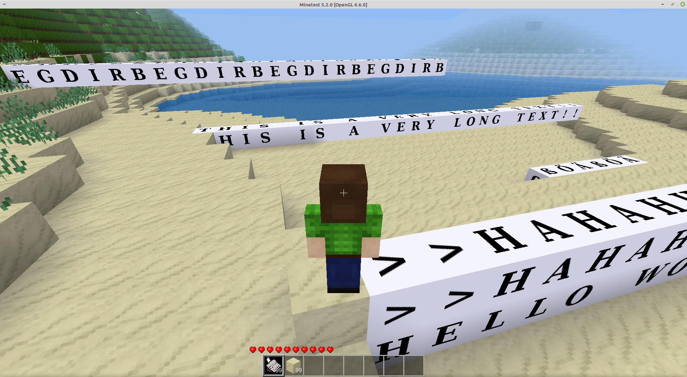

# ehltype

adds the typewriter craftitem to the game

this item can be used to simplify the placement of lines of text into the world using the ehlphabet blocks. the ehlphabet mod can be found at https://git.bananach.space/ehlphabet.git

